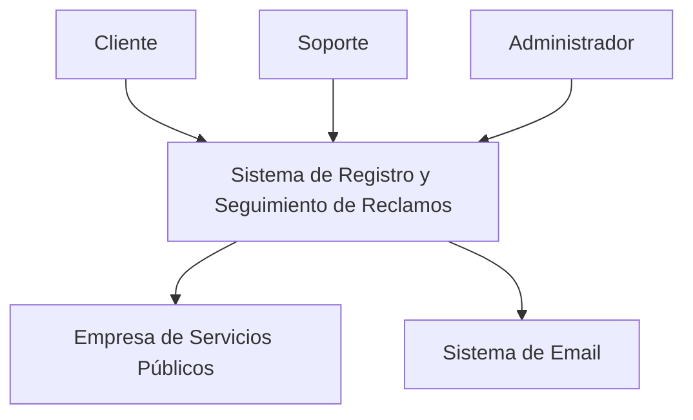

# Diagrama de Contexto

El diagrama de contexto muestra las interacciones del sistema con actores externos.

## Descripción
- **Cliente:** Usuario final que registra reclamos, consulta estados y recibe notificaciones.
- **Sistema de Registro y Seguimiento de Reclamos:** El sistema principal.
- **Empresa de Servicios Públicos:** Entidad que gestiona los reclamos internamente.
- **Sistema de Email:** Servicio externo para enviar notificaciones.
- **Soporte:** Personal de soporte que responde a reclamos.
- **Administrador:** Usuario con permisos avanzados para gestionar el sistema.