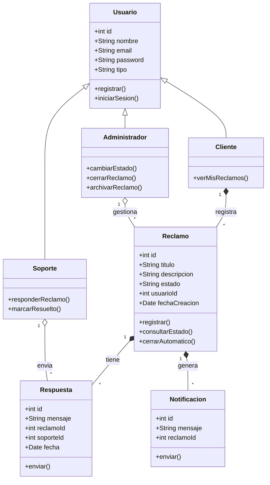

# Diagrama de Clases

## Descripción
- **Usuario:** Clase base con atributos comunes.
- **Cliente:** Usuario que registra reclamos.
- **Soporte:** Usuario que responde y marca reclamos como resueltos.
- **Administrador:** Usuario con permisos avanzados (cambiar estados, cerrar, archivar).
- **Reclamo:** Ticket principal con estados y cierre automático.
- **Respuesta:** Mensajes de soporte a reclamos.
- **Notificacion:** Alertas por email.