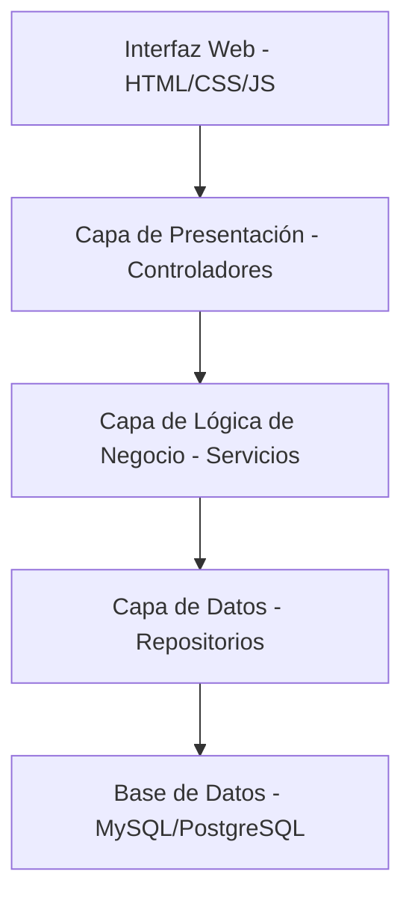

# Diagrama de Vista de Desarrollo

## Descripción
- **Capa de Presentación:** Maneja la interacción con el usuario.
- **Capa de Lógica de Negocio:** Contiene las reglas de negocio.
- **Capa de Datos:** Gestiona el acceso a datos.
- **Base de Datos:** Almacena información persistente.