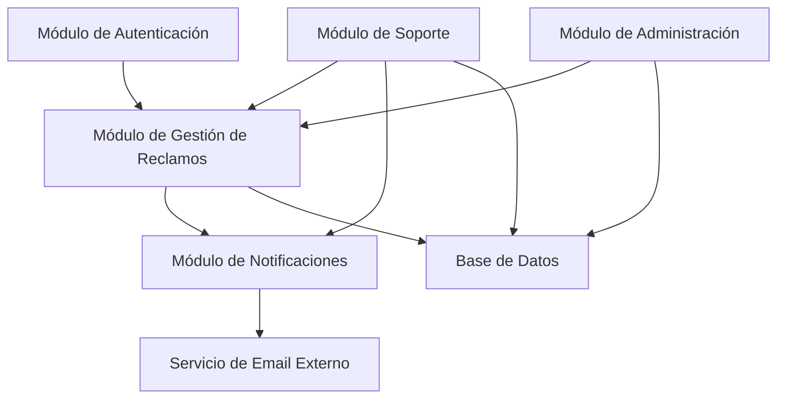

# Diagrama de Componentes

## Descripción
- **Módulo de Autenticación:** Maneja registro e inicio de sesión para todos los tipos de usuario.
- **Módulo de Gestión de Reclamos:** Gestiona creación, consulta y actualización de reclamos.
- **Módulo de Notificaciones:** Envía notificaciones a usuarios.
- **Servicio de Email:** Componente externo para envío de correos.
- **Base de Datos:** Almacena datos del sistema.
- **Módulo de Soporte:** Permite a soporte responder y cerrar reclamos.
- **Módulo de Administración:** Permite a admins gestionar reclamos avanzadamente.